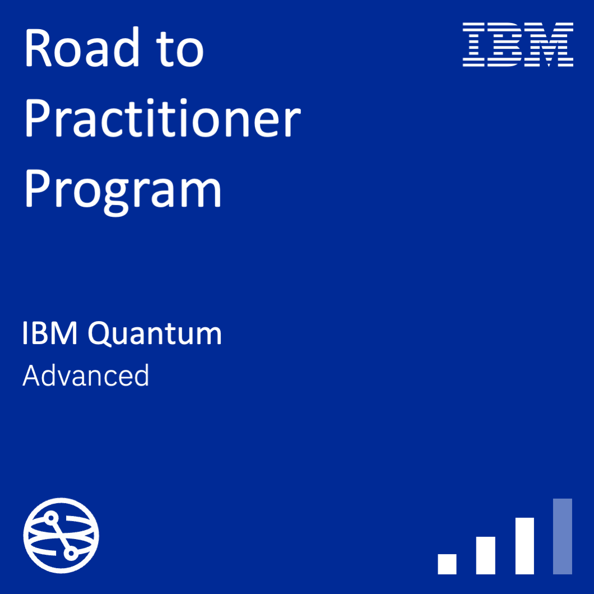

# Road to Practitioner (R2P)

<a href="https://www.credly.com/org/ibm/badge/road-to-practitioner-program">
  
</a>

Invite-only 12-week IBM Quantum program for selected client learners from diverse roles. It mixes theory with hands-on Qiskit coding so participants become practitioners who can run utility-scale workloads.

Five units grow in complexity—from Qiskit basics to utility-scale methods such as sample-based quantum diagonalization (SQD)—and finish with a team Capstone: a toy research project on a use case of interest. Passing the Capstone qualifies for the [Road to Practitioner Program](https://www.credly.com/org/ibm/badge/road-to-practitioner-program) badge.

**By the end of the program, a learner can:**

- Apply core quantum algorithms, Qiskit Patterns, and quantum–classical hybrid workflows
- Use current Qiskit tooling for transpilation, error mitigation, variational methods (QAOA, VQE), QML, Hamiltonian simulation, and SQD
- Run dynamic circuits (including mid-circuit measurement) and utility-scale jobs on IBM Quantum hardware with Qiskit Runtime

This repo holds the coursework, coding assignments, and Capstone challenges from the program.

## Layout

- `Capstone Project/` — capstone challenges (QMOO, SKQD, Hadron–Schwinger), helpers, and environment files
- `Assignment 3/` — Unit 3 coding assignment
- `Lectures/` — unit slides
- Root notebooks — Units 1, 2, and 4 coding assignments plus workshop/lab notebooks

## Local setup

Use the Windows requirements file on this machine:

```powershell
python -m venv .venv
.\.venv\Scripts\Activate.ps1
pip install -r "Capstone Project/requirements-windows.txt"
```

On other platforms, use `Capstone Project/requirements.txt`.

IBM Quantum API keys belong in local files only. Do not commit `apikey.json` or similar credential files — they are gitignored.

## Capstone notes

Open and run `Capstone Project/Guide_and_install.ipynb` first. For each challenge, keep the helper modules and data files alongside the notebook; the notebooks depend on them.
